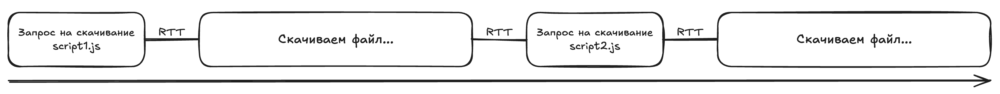
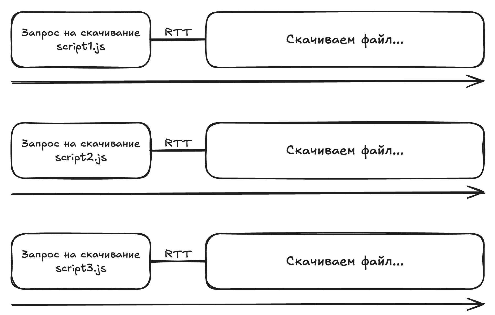
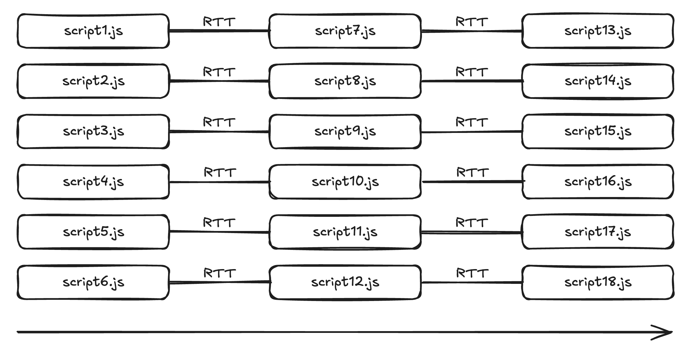
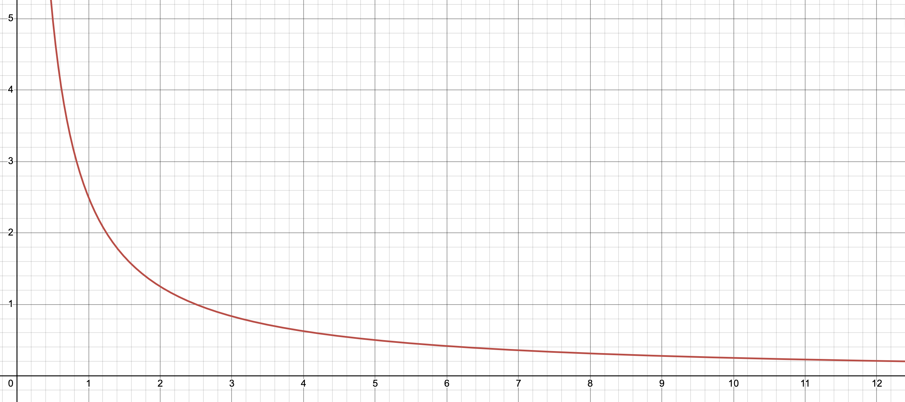
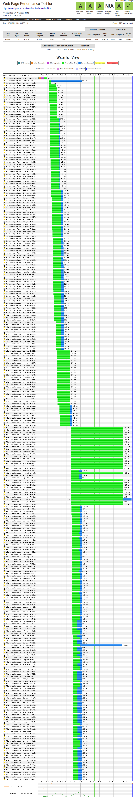
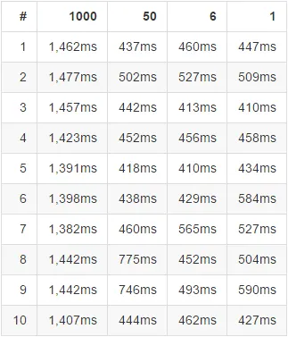
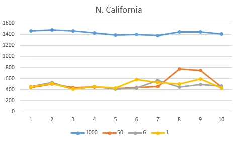

# Пишем свой Vite   
# Материалы   
1. **История развития бандлеров (конкатенация скриптов [→ browserify -> webpack)](https://nolanlawson.com/2017/05/22/a-brief-and-incomplete-history-of-javascript-bundlers/)** [: https://nolanlawson.com/2017/05/22/a-brief-and-incomplete-history-of-javascript-bundler](https://nolanlawson.com/2017/05/22/a-brief-and-incomplete-history-of-javascript-bundlers/)s/    
2. **Глубокое погружение в Webpack**: [https://youtu.be/aiYkJOPD9v8](https://youtu.be/aiYkJOPD9v8?si=pPDb5SzAU1y0uLyi)   
3. **Всё есть плагин**: [https://youtu.be/4tQiJaFzuJ8?si=nDfn3xeCg\_gRN62X](https://youtu.be/4tQiJaFzuJ8?si=nDfn3xeCg_gRN62X)    
4. **Webpack & HTTP/2:** [https://medium.com/webpack/webpack-http-2-7083ec3f3ce6](https://medium.com/webpack/webpack-http-2-7083ec3f3ce6)    
    1. **Отказаться от сборщиков JS? Не так быстро: **[https://blog.khanacademy.org/forgo-js-packaging-not-so-fast/](https://blog.khanacademy.org/forgo-js-packaging-not-so-fast/)    
    2. **Как правильно упаковать сайт при использовании HTTP/2: **[https://medium.com/@asyncmax/the-right-way-to-bundle-your-assets-for-faster-sites-over-http-2-437c37efe3ff](https://medium.com/@asyncmax/the-right-way-to-bundle-your-assets-for-faster-sites-over-http-2-437c37efe3ff) (эта статья мне больше нравится, чем статья khana academy, там довольно подробные бенчмарки проводятся)   
5. **Connection management in HTTP/1.x:** [https://developer.mozilla.org/en-US/docs/Web/HTTP/Guides/Connection\_management\_in\_HTTP\_1.x](https://developer.mozilla.org/en-US/docs/Web/HTTP/Guides/Connection_management_in_HTTP_1.x)    
   
# Текст лекции   
## Как писали раньше?   
Раньше сайты представляли собой HTML-страницы с ссылками на другие HTML-страницы. В какой-то момент нам захотелось, чтобы наши сайты как-то выделялись, были красивее, чем просто голый текст. Появился CSS, который позволяет изменять внешний вид HTML-элементов. После этого нам захотелось добавить интерактивности, которая бы исполнялась на стороне клиенте, на стороне браузера. Тогда появился JavaScript, который по сути является вполне себе полноценным turing-полным языком программирования, который исполняется на стороне браузера и который может читать или изменять структуру текущей страницы.   
По мере роста проекта разрабатывать проект в одном исходном файле становится всё сложнее и сложнее, особенно, если ваша команда состоит не из единолично вас, а из нескольких человек. Закономерным выходом из этой ситуации становится разбиение проекта на несколько файлов.   
```
<!doctype html>
<html>
<head>
  ...
</head>
<body>
  ...
  <script src="/auth.js" />
  <script src="/dashboard.js" />
  <script src="/products.js" />
  <script src="/shared.js" />
</body>
</html>

```
Чем больше проект, тем больше таких файлов будет копиться. И здесь мы сталкиваемся с другими проблемами, связанными с сетями.   
## Бой с сетью, как смысл жизни   
### Почему создание HTTP(S)-соединения – это дорого?   
Для начала введём понятие **RTT (round-trip delay)**. По сути это время, за которое запрос идёт от клиента до сервера + время, за которое клиент получает ответ от сервера. RTT можно воспринимать, как единицу измерения, которое переводится в реальное время в зависимости от качества сети. При проводном интернете размер одного RTT будет одним, при мобильном другим, а если к этому всему прибавить все возможные технологии, которые… скажем так, стали в последние годы весьма актуальны в нашей стране, то один RTT станет довольно большим.   
Допустим, мы хотим сделать запрос на файл по HTTPS. Для этого нужно сделать следующее.   
1. **Получить IP-адрес, на который ссылается домен**. Тут RTT может быть очень плавающим. Его может и вообще не быть, если DNS-запись закэширована на машине пользователя. Если же нет, то тут начинается веселье. Без глубокого погружения в то, как работает DNS-сервера можно это представить так. Допустим, вам необходимо получить справку в какой-либо государственной организации. Вы спрашиваете сотрудника на входе "я хочу получить справку", он вам говорит, на какой этаж и кабинет вам сходить для получения справки. Дальше вы встречаете другого сотрудника, но уже на входе в кабинет, спрашиваете всё тот же самый вопрос. Она вас отправляет уже в другой кабинет. Уже во втором кабинете с вами проделывают то же самое. И так вплоть до N-го кабинета, в котором вам наконец-то отдадут нужную вам справку. А теперь сотрудников заменяем на DNS-сервера или резолверы, а справку на IP-адрес нашего сервера.   
2. **TCP-handshake**. Он необходим для того, чтобы обе стороны (и клиент, и сервер) убедились, что обмен сообщениями может идти в обе стороны: и от клиента к серверу, и от сервера к клиенту; а также для установки максимального размера сегмента (MSS) на стороне и клиента, и сервера. Это занимает 1 RTT.   
3. **TLS-handshake**. Он необходим, во-первых, для того, чтобы клиент и сервер выработали общие ключи шифрования; во-вторых, чтобы сервер подтвердил, что он является тем, за кого он себя выдаёт, с помощью TLS-сертификата; в-третьих, чтобы определить, какая версия TLS, какой набор криптографических алгоритмов и прочие параметры защищённого соединения будут использоваться. Занимает 1-2 RTT.   
   
Отлично! Мы установили соединение. Давайте же быстрее слать пакеты!.. А нам точно стоит это делать как можно быстрее? И здесь мы сталкиваемся с *slow start* в протоколе TCP. Для объяснения, что это такое, рассмотрим понятие ACK.   
**ACK** – это сообщения от получателя, что данные успешно дошли до определённого места, и что он ожидает следующие данные с определённого номера. Например, если мы отправили с 100 по 200 байт, то ACK с номером 201 означает, что байты с 100 по 200 были получены и от нас ожидаются данные, начиная с 201 байта.   
Клиент мог бы действовать очень аккуратно. Например, он может отправить данные размером в один SMSS (максимальный размер сегмента, который способен отослать отправитель), после чего дождаться ACK и только после этого отправить следующий сегмент данных. Но в таком случае это будет медленно. А что если клиент будет слать больше данных без подтверждения? Тогда пакеты начнут теряться из-за перегрузки каких-либо узлов, которые находятся между клиентом и сервером. Как достичь баланса вселенной?   
Для этого в TCP используется** Congestion window (cwnd)** – это количество данных, которое отправитель отсылает, не дожидаясь подтверждения. Отправитель начинает аккуратно. Выставляется достаточно малый размер окна, чаще всего кратный SMSS. По мере прихода ACK размер этого окна увеличивается. "Амортизированно" оно увеличивается примерно в два раза за 1 RTT. Получается экспоненциальный рост. Данный режим называется **slow start**.    
Дальше, когда отправитель достигнул некоторого порогового значения ssthresh, которое изначально выставляется очень и очень большим, отправитель переходит в другой режим, в котором рост окна происходит не так агрессивно. Если TCP видит признаки перегрузки сети (например, потери пакетов), то ssthresh понижается.   
Подробнее с устройством TCP можно ознакомиться, например, в [ролике AlekOS](https://www.youtube.com/watch?v=EJzitviiv2c).   
### Начинаем качать файлы (по HTTP/1.1 и последовательно)   
После смертельной дозы "базы" можно приступить к тому, ради чего мы здесь собрались – немного скачать файлов. Пусть в нашем проекте будет 200 JS-файлов, HTTP/1.0 без дополнительных заголовков, а ещё мы не умеем распараллеливать процесс скачивания файлов. В таком случае мы будет на каждый файл создавать одно TCP-соединение, скачивать файл, после чего соединение закрывать. И так 200 раз… Вместе со всеми рукопожатиями, slow start'ами и прочим…   
Теперь добавим заголовок `Connection: keep-alive;` (либо переходим на HTTP/1.1, где данный режим стоит по умолчанию). Поздравляем, мы научились последовательно скачивать 200 файлов, открывая лишь одно TCP-соединение. Всевозможные рукопожатия и slow start'ы происходят один раз… Эффективно… Наверное…   
    
Проблема возникает в том, что для скачивания файла нам нужно сделать запрос и получить ответ на наш запрос. А это ровно один RTT. И это нужно проделывать для каждого файла. Для наших 200 файлов мы получим задержки с длительностью 200 \* RTT. При RTT = 100 мс, это будет 200 умножить на 100 мс = 20000 мс или 20 секунд. По итогу, чем больше файлов, тем больше копится RTT ⇒ больше задержки. Получается, скачивать один большой файл в данной ситуации эффективнее, чем несколько маленьких.   
### Продолжаем качать файлы (по HTTP/1.1, но параллельно)   
Но что если мы создадим несколько соединений и будем по ним скачивать файлы? В таком случае RTT уже не будут складываться.   
    
И казалось бы, отличное решение! Но у него есть несколько проблем.   
1. Каждое соединение, как мы уже знаем – это постоянные рукопожатия, slow start'ы и прочее.   
2. Каждое соединение – это нагрузка на сервер.   
3. Каждое соединение – это нагрузка на браузер.   
4. Большое количество соединений на один сайт банально может помешать другим вкладкам в вашем браузере.   
5. Большое количество соединений конкурируют за ограниченные ресурсы (ровно так же, как это делает большое количество потоков в операционной системе).   
   
Именно поэтому современные браузеры имеют ограничение в 6 одновременных соединений на один hostname. По итогу мы уменьшили задержки в 6 раз. То есть было 20 секунд при 200 файлах, а стало 3 секунды. Уже не настолько плохо, но несложно прикинуть, что будет, если скриптов станет больше. Например, при 1000 файлах это уже будет 15 секунд.   
    
Но разработчики сайтов не получали бы свой хлеб, если бы не имели смекалку. Вот они и придумали костыль, чтобы обойти данное ограничение, и оно носит имя domain sharding.   
Суть в том, что мы сделаем несколько доменов и распределим скачиваемые файлы по ним. При двух доменах мы уменьшим задержки ещё в два раза. При 1000 файлах это будет 7.5 секунд. При трёх доменах в три раза, это будет 5 секунд… Кстати, следует заметить, что с каждым новым доменом импакта от этого становится всё меньше и меньше.    
    
Что ж… мы обошли ограничения создателей браузеров! Можем вас поздравить. Правда, от проблем большого количество соединений, от которых создатели браузеров нас пытались так уберечь, мы не избавились. Так ещё и получили оверхед за счёт лишних обращений к DNS…   
Но тем не менее… может и не нужны так сильно эти ваши вебпаки…   
### Святой HTTP/2 и мультиплексирование   
Что ж… давайте добьём эти ваши вебпаки, роллапы и прочую ересь. Ведь умные люди придумали HTTP/2 и мультиплексирование! Теперь мы можем использовать одно соединение для параллельного скачивания большого количества файлов. Никакого domain-шардинга, никаких накладных расходов на большое количество соединений…   
Что ж… на этом моменте, пожалуй, стоит перестать теоретизировать. Обратимся к практике.   
Первая проблема, с которой вы можете столкнуться, это ограничение на количество параллельно скачиваемых файлов при мультиплексировании… Да, оно не такое сильное, как в HTTP/1.1, но оно всё равно есть. Привожу фотографию из этой [статьи](https://blog.khanacademy.org/forgo-js-packaging-not-so-fast/):   
    
Вторая проблема, это рост задержек при большом количестве файлов… Да, рост всё ещё не такой большой, но он есть. С этим столкнулись авторы [этой статьи](https://medium.com/@asyncmax/the-right-way-to-bundle-your-assets-for-faster-sites-over-http-2-437c37efe3ff), когда они проводили свои бенчмарки.    
    
    
Да… Проблема возникала лишь при очень большом количестве файлов (в данном случае, при 1000). При 50, а уж тем более при 6 всё довольно терпимо.    
### А что с кэшом?   
Что ж… Даже в HTTP/2 сборка всего в один файл показывает свою эффективность. Давайте так и сделаем? Просто свалим весь код в один файл.   
Но здесь может возникнуть другая проблема. Например, ваш проект использует React, Redux и ещё тонну с лишним других библиотек. И вы решили в своих скриптах поменять одну маленькую константу. Однако, если у вас всё свалено в один файл, пользователю придётся перекачать абсолютно весь JS-bundle. Если вы довольно часто поставляете в production новые мелкие релизы, это будет больно.   
Но как мы выяснили выше, слишком большое количество файлов неэффективно скачивать по сети. Так что какое-то N количество файлов держать следует. Я здесь не буду говорить, какие конкретно числа будут хорошими. Думаю, оставим это на совесть тех, кто будет проводить замеры производительности конкретно на вашем сайте.   
### Ещё немного забавных фактов   
Во-первых, много маленьких файлов помимо нагрузки на сеть дают нагрузку и на вашу файловую систему. Наверняка замечали, что копировать большое количество мелких файлов медленнее, чем один большой файл.   
Во-вторых, архивирование больших файлов каким-нибудь gzip'ом происходит эффективнее, чем архивирование маленьких файлов. Просто из-за особенностей алгоритма gzip.   
## А для чего ещё нужны сборщики?   
Кажется, мы довольно подробно разобрались в том, зачем нам необходимо объединять множество мелких файлов в один или несколько больших. Это, кстати, относится не только к JS, но и к CSS, и к мелким иконкам, которые часто объединяются в спрайты.   
Помимо этого сборщики также нужны для минификации кода JS и CSS. А ещё для разрешения зависимостей проекта. Да, в современных браузерах есть нативная поддержка ES-модулей (чем Vite, кстати, пользуется в dev-режиме), а значит браузер умеет сам разрешать зависимости. Но не забываем, что проблема большого количества маленьких файлов даже в HTTP/2 все ещё актуальна, а значит и разрешать зависимости проекта приходится не браузеру, а сборщику.   
Ну и сборщики во многом повышают удобство разработчика. Всевозможные hot-reload, hot module replacement, dev-сервера, базовые шаблоны для проектов и многое другое здорово скрашивают опыт разработчика.   
   
